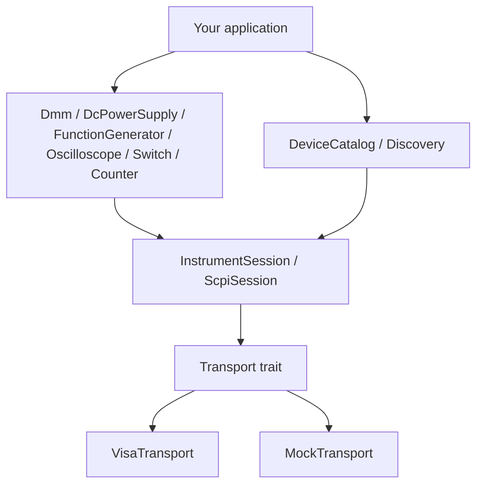

# Architecture

## Crate layout

```
instrument-components   (facade — package name; lib name is `instrument`)
├── instrument-core     (VISA-agnostic: Transport, SCPI, mocks, classifier)
└── instrument-visa     (visa-rs backend, optional via `visa` feature)
```

Consumers typically depend only on `instrument-components` and use `instrument::prelude::*`.

## Layered design



## Async path (`tokio` feature)

The async stack mirrors sync with separate types (shared `DiscoveredDevice` data and SCPI framing logic):

| Sync | Async |
|---|---|
| `Discovery` | `AsyncDiscovery` |
| `DeviceCatalog` | `AsyncDeviceCatalog` |
| `ScpiSession` | `AsyncScpiSession` |
| `VisaTransport` | `VisaAsyncTransport` |

VISA session open remains sync; async applies to SCPI I/O and discovery probe concurrency (`JoinSet` + `Semaphore`).

## Key abstractions

| Layer | Type | Responsibility |
|---|---|---|
| Discovery | `Discovery` | Scan VISA bus, classify devices, build catalog |
| Catalog | `DeviceCatalog` | List devices, open sessions, health snapshots |
| Session | `InstrumentSession` | Active connection + cached identity |
| SCPI | `ScpiSession` | Command framing, retry, diagnostics |
| Transport | `Transport` | Byte-level I/O (swappable backend) |
| Typed | `Dmm`, etc. | IVI-inspired methods in SI units |

## Multi-session model

- `DeviceRef::open_session()` opens independent sessions to the same address.
- `SessionPool` shares one underlying session across typed views (e.g. SMU as DMM + PSU).

## Classification pipeline

Discovery merges hints from:

1. Resource string parsing (USB VID/PID)
2. VISA attributes (manufacturer, model)
3. `model_registry.toml` hints
4. SCPI `*IDN?` / `*OPT?`
5. Capability probes (`ProbePolicy::ReadOnly` by default)
6. User overrides

## Testability seam

`ResourceEnumerator` and `SessionOpener` traits let you inject `StaticEnumerator` and `MockSessionOpener` without VISA — this is how CI tests discovery logic without hardware.
