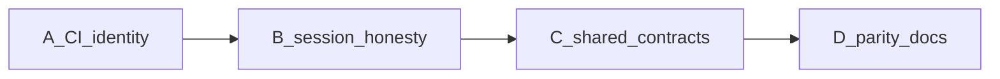

# Roadmap

The previous “all class-depth phases complete; next is publishing” framing overstated readiness. Dual-native work now follows [dual-native-plan.md](dual-native-plan.md).

## Historical (kept for context)

Parity / C# competitiveness and class-depth / docs-site phases landed as **API surface**, not as hardware-verified support. See the capability matrix for Base vs Extension rows and remaining `partial` / `todo` / `deferred` items.

**Still deferred:** package publishing (`0.2.0`), UniFFI, process-supervised HAL, IVI Config Store / `IIvi*` conformance, self-hosted VISA runners.

Dialect profiles live under `crates/instrument-core/data/dialects/` and are generated via `tools/gen-dialects.ts`.
