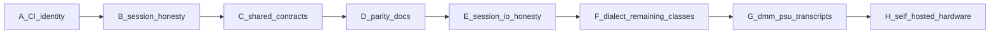

# Roadmap

Dual-native work follows [dual-native-plan.md](dual-native-plan.md). Streams A–F are merged (`latest`; F is [#11](https://github.com/josh-hemphill/instrument-components/pull/11)). G (DMM/PSU transcripts and vendor dialects) and H (self-hosted DMM smoke) are the remaining dual-native slices.

**Still deferred:** package publishing (`0.2.0`), UniFFI, process-supervised HAL, IVI Config Store / `IIvi*` conformance, vendor VISA on GitHub-hosted CI.

**Parallel (C# only, does not block G/H):** OpenTAP pack shipping **all eight** instrument types plus session injection for HardwareTest — see [opentap-consumer.md](opentap-consumer.md). F is already merged; this track does not implement G or H.

Neither NI nor Keysight ships a CI-loadable VISA/instrument emulator. GitHub-hosted CI stays on MockTransport + transcripts. See [Hardware emulators](dual-native-plan.md#hardware-emulators-ni--keysight).

Dialect profiles live under `crates/instrument-core/data/dialects/` and are generated via `tools/gen-dialects.ts`.
