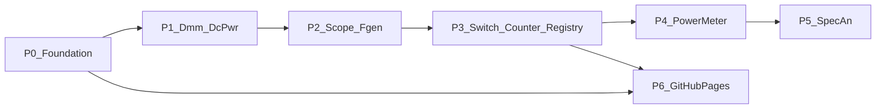

# Roadmap

## Completed: Parity / C# competitiveness

| Phase | Goal | Status |
|---|---|---|
| 0 — Foundation | Shared parity definition + roadmap docs | Done |
| 1 — Parity CI | .NET on `latest`; async/diagnostics/discovery tests; more fixtures | Done |
| 2 — Shared tables | TOML → codegen for SCPI commands + capability probes | Done |
| 3 — C# time-to-first-volt | `dotnet/examples` + getting-started docs | Done |
| 4 — C# VISA cross-platform | `net8.0` TFM; Ubuntu compile CI; Linux docs | Done |
| 5 — VISA async honesty | Document sync-bridge; APM spike go/no-go | Done (keep sync bridge) |

**Deferred (unchanged):** package publishing, UniFFI / Interoptopus as a replacement for `dotnet/` (Interoptopus 0.16 is the stronger C# generator — see [interop-eval.md](interop-eval.md)), process-supervised HAL, IVI Config Store / `IIvi*` conformance.

## In progress: Class depth, RF classes, docs site

See [capability-matrix.md](capability-matrix.md) for Base vs Extension rows.

| Phase | Goal | Status |
|---|---|---|
| 0 — Foundation | Capability matrix + dialect profile schema/codegen | Done |
| 1 — Dmm + DcPwr | IVI-style base depth | Done |
| 2 — Scope + Fgen | Trigger, burst, waveform improvements | Done |
| 3 — Switch/Counter + registry | Polish + curated registry growth | Done |
| 4 — PowerMeter | Kind + common API + dialect profiles | Done |
| 5 — SpectrumAnalyzer | Kind + common API + dialect profiles | Done |
| 6 — GitHub Pages | MkDocs Material, Rust\|C# tabs, lang deep dives | Done |

All class-depth / RF / docs-site phases are complete. Next release train is package publishing (deferred).

Dialect profiles live under `crates/instrument-core/data/dialects/` and are generated via `tools/gen-dialects.ts`.
